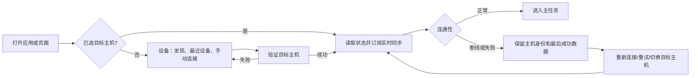
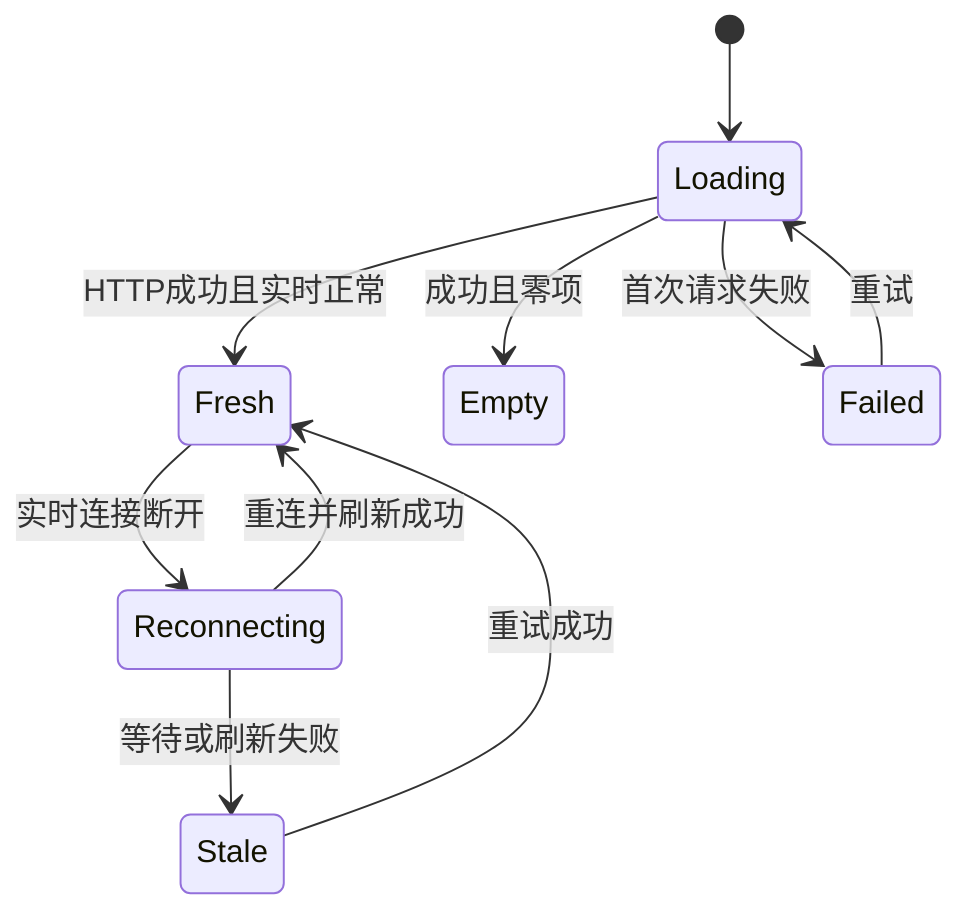
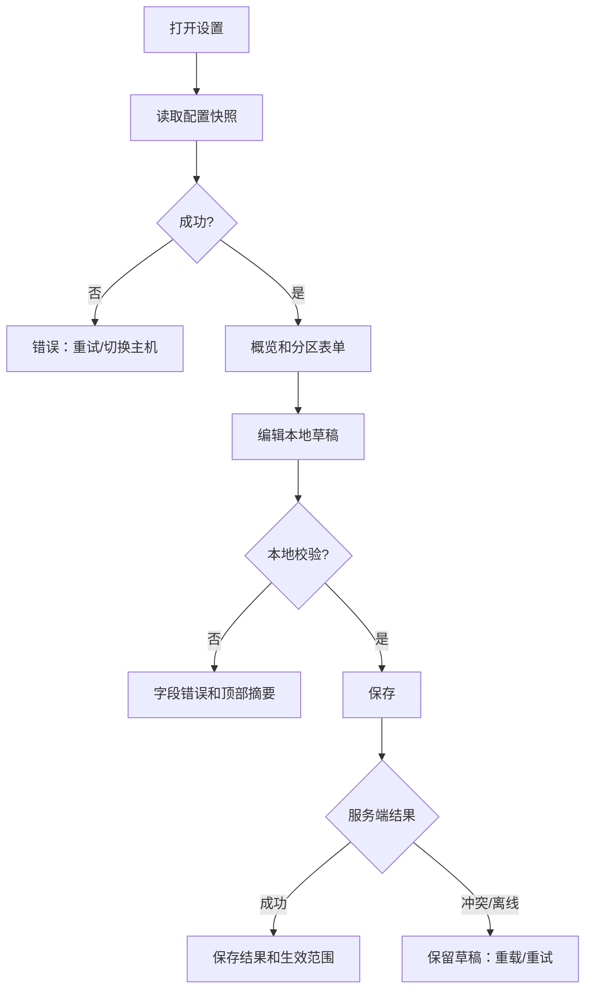
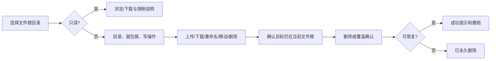
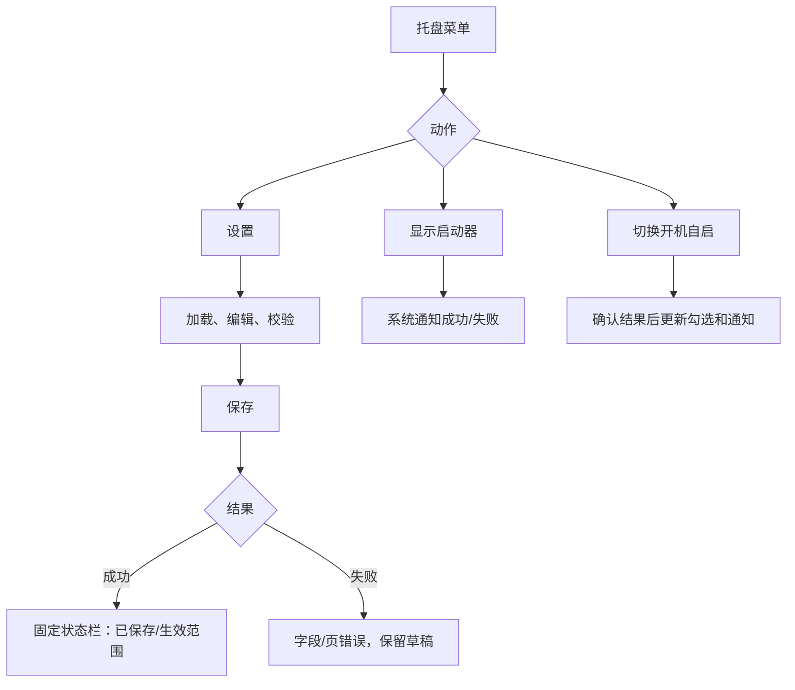

# 全仓审查问题修复：UX/UI 与可访问性设计

## 0. 范围、用户与统一语言

本规格面向维护家用街机 Windows 主机的操作者与配置维护者，覆盖 Android Compose、PC Web、Windows Avalonia/托盘。它只整理现有能力的用户流程、状态、组件、响应式和可访问性，不新增业务能力。历史 UI 仅复验现状；本文不以设计文字宣称功能已实现或验收通过。

**非范围：**认证、LAN 边界、凭据、权限与任何安全整改。确认框和目录说明仅用于避免误操作；接口不支持的恢复能力不得由前端伪造。

| 项目 | Android | PC Web | Windows |
|---|---|---|---|
| 既有语言 | Material 3、BentoCard、系统浅/深色 | 深色控制台：背景 #0B0D11、卡片 #14181F、强调 #58E6C9 | Fluent/Avalonia 原生控件和系统高对比度 |
| 常用间距 | 8/16/24/32dp | 8/16/24/32px | 8/16/24px |
| 文字/目标 | 正文≥14sp；目标≥48dp | 正文≥14px；常用目标高40px | 正文≥14px；首选目标高40px |

状态必须是**颜色 + 图标 + 中文文字**，不能只靠颜色。PC 文字对比≥4.5:1，焦点/边框/图标≥3:1。

| 概念 | 统一文案 | 禁止混用 |
|---|---|---|
| 被控电脑 | 目标主机 | 设备、Agent、PC 作同一标题 |
| 网络可用 | 已连接；实时同步正常 | 单独“在线” |
| 旧值 | 数据可能已过期 | 把陈旧数据当正常/空数据 |
| 文件范围 | 文件根目录；只读文件根目录 | 单独“根” |
| 启动项 | 启动项目 | 无上下文“当前项” |
| 关闭 | 关闭当前项目；远程关机 | 都写“关闭” |
| 删除 | 删除文件/删除启动项目/移除文件根目录 | 无对象“删除” |

目标格式：`目标主机：{machineName}（{address}）`；名称缺失写`目标主机：未命名（{address}）`。错误格式：`无法{动作}。{可理解原因}`，HTTP码仅在可展开详细信息中出现。

## UX-01 导航、连接与目标主机

### 用户流程


### IA、页面状态与组件规范
- **Android 顶级导航固定五项：**音频、文件、启动器、管理、设备。保留 Material NavigationBar 图标和标签；320dp 仍显示标签。Power 不做第六 Tab：仅已连接时，管理首屏“风险操作”卡的“远程关机”进入二级 `PowerScreen`。系统返回、顶栏返回和无障碍返回均回管理，管理仍为选中底栏项；Power 不能作为顶级目的地恢复。
- **Android 无连接：**五项底栏保留，设备页是连接入口；音频、文件、启动器和管理均显示“尚未连接目标主机”及“前往设备”。管理页风险操作不可进入 Power，显示“连接目标主机后可进行远程关机”。从恢复状态进入 Power 时如已失连，显示无连接页（“前往设备”“返回管理”），不显示确认或可提交动作；切换主机时先关闭确认并清除旧主机状态，再回管理加载新主机。
- **PC Web 顶栏：**音频、文件、启动器、电源、设置；当前项有文字、视觉态和 `aria-current=page`。当前页面主机按钮显示当前 `window.location.origin`、已验证名称、版本、上次更新及重新连接。选择最近主机或输入合法 absolute `http(s)` origin 后，以 `window.location.assign(targetOrigin + 当前 pathname + search + hash)` 整页同源导航；新页面独立加载静态资源、HTTP、WS 和缓存，旧页 Toast、Dialog、草稿和局部数据不得带入。开发代理只作开发适配，不承诺跨 origin 切换。当前 origin 首次读取失败时留在当前页，显示“无法连接当前页面主机”，提供重试、最近主机和“转到其他主机”；不得显示旧缓存或将失败伪装为空状态。
- **Windows 托盘：**状态、显示启动器、设置、开机自启、退出。设置窗分区：概览、启动器、启动项目、文件根目录、远程关机。
- Android/PC 远端写页面，在标题后、首操作前有状态条：
```text
[状态图标] 目标主机 {machineName}                 [切换目标主机]
           {address} · {实时同步正常/正在重新连接/数据可能已过期}
```
Android全宽、至少72dp、内边距16dp；PC最大960px、至少64px，窄屏将切换按钮换行全宽。

| 状态 | 呈现 | 可用操作 |
|---|---|---|
| 未选择（Android） | 尚未连接目标主机；仅设备页展示发现、最近设备和手动连接 | 前往设备；其余四项禁写且不伪造主机 |
| 当前 origin 不可达（PC） | 无法连接当前页面主机；不显示旧数据 | 重试当前主机、选择最近主机、转到其他主机；禁写 |
| 首次连接中 | 正在连接目标主机… + 骨架 | 取消、切换/转到其他主机 |
| 已连接 | 实时同步正常 | 正常读写 |
| 重连 | 正在重新连接；数据可能暂未更新 | 仅浏览；禁写 |
| 离线 | 无法连接目标主机 + 最近成功时间 | 重试、切换；禁写 |
| 陈旧 | 数据可能已过期 · 上次更新HH:mm | 浏览；刷新前禁写 |

Android 切换主机有草稿时显示“未保存的更改”，默认焦点“留在此页”，次动作“继续切换”。确认后清除旧主机 Toast、Dialog 和局部数据，重新加载；不得旧主机名配新数据。PC Web 同源切换前先处理当前路由的脏草稿，确认放弃后才导航，草稿不得跨主机恢复。

### 无障碍、响应式、验收、决策与待定
- 切换路由后焦点移到h1/Compose标题；状态用非打断公告，离线/写失败只公告一次。发现设备采用整卡连接或独立按钮二选一，推荐整卡名称“连接到{name}，{address}”。
- Android <600dp单列，≥600dp内容最大720dp；PC <768px顶栏横向滚动而非汉堡菜单，≥768px主内容最大1200px。
- **UX-AC-01：**每个写操作前可见主机名、地址、文本状态。**UX-AC-02：**离线/陈旧时保存、删除、启动、停止、关机不可触发。**UX-AC-03：**Android 仅五项顶级导航；Power 仅从管理首屏风险操作卡进入、返回管理，未连接不得触发确认或提交。
- **UX-AC-03a：**PC Web 的读取、HTTP、WS、缓存和显示身份均属于当前 `window.location.origin`；切换保留路由但通过整页同源导航完成，旧页数据不可显示在新页。
- **设计决策：**以目标主机建立连续上下文，降低多主机误操作；Power 是低频高风险任务，收纳于管理。PC Web 以页面 origin 而非运行时跨 origin 连接建立该上下文。
- **批准记录（2026-08-02）：**Android 采用五项底栏和“管理 → 电源操作”的二级导航；PC Web 采用同源导航。本文以此覆盖先前“Android 六项底栏/顶级 Power”及“PC 单页跨 origin 切换”的 UX 解释；不得同时实施两种 IA。
- **待定 D-04（已收敛）：**PC Web 不编辑或持久化可变 API 地址；目标切换仅接受合法 origin 并保存导航元数据。

## UX-02 加载、错误、重连与陈旧数据

### 用户流程


| 状态 | 视觉/文案 | 恢复 |
|---|---|---|
| 首次加载 | 3-5行静态骨架；正在加载{对象}… | 超过10秒显示仍在加载 + 重试/取消 |
| 有数据刷新 | 保留数据，小进度环 + 正在刷新 | 禁止整页闪烁 |
| 成功空 | 图标、明确原因、主操作和可选次操作 | 添加启动项目、立即扫描等 |
| 首次失败 | 错误卡、原因、重试、切换目标主机 | 不渲染为空目录/未配置 |
| 重连中 | 非阻塞横幅 + 状态条 | 自动重连、立即重试 |
| 陈旧 | 最近成功时间警告横幅 | 成功刷新前禁写 |
| 冲突 | 配置已被其他操作更新 | 保留草稿，重新加载最新设置 |

共享状态框语义：loading、refreshing、empty、error、stale。后台事件不能覆盖用户编辑中的设置草稿；显示“检测到外部更新”，只有用户确认重载才覆盖。

### 无障碍、响应式、验收、决策与待定
- 骨架aria-hidden，另设role=status加载文案；新阻断错误role=alert且不重复播报；遵从减少动态效果。
- 窄屏横幅按钮换至说明下方；Android大字/PC 200%下时间、错误、恢复按钮不截断。
- **UX-AC-04：**首次失败、成功空、陈旧数据在视觉、语义、恢复路径不同。**UX-AC-05：**重连期所有写操作禁用并说明原因。**UX-AC-06：**200%缩放完整显示错误和恢复。
- **设计决策：**数据可信度是业务状态，不能用单一刷新布尔值替代。
- **待定 D-01：**上次更新时间来源/时区；默认客户端最近成功时间并称“上次刷新”。

## UX-03 Android Compose：管理、Power与表单校验

### 用户流程
设备页发现或手动验证主机，成功后点“开始使用”进入音频。管理页先展示目标主机、保存状态和分区；仅已连接时风险操作卡进入 Power。Power 的顶栏返回和系统返回均回管理，管理仍是选中底栏项；无连接时风险操作不可达，从恢复状态进入 Power 后失连时关闭确认并显示无连接页。字段在失焦或保存时校验，服务端错误映射字段/摘要并保留草稿。

### 布局、状态和组件规范
- M3顶栏64dp；正文左右16dp、卡间16dp、底部24dp。
- 管理顺序：目标主机 → 启动器行为 → 导航按键 → 启动项目 → 文件根目录 → 远程关机 → 保存更改。
- <600dp标签在输入上方、字段全宽；≥600dp标签列176dp、字段列至少320dp。命令/路径/备注是多行输入，至少72dp，不能singleLine。
- 顶部可见保存状态：未保存的更改 / 正在保存… / 所有更改已保存；Snackbar仅补充。
- Power 有目标条、风险说明、全宽错误色“远程关机”；不可用时按钮邻近说明原因。连接、能力或可用性变化时关闭确认并回到不可用说明，绝不提交旧上下文请求。

| 字段 | 校验时机 | 字段级反馈 |
|---|---|---|
| 地址 | 失焦/提交 | 请输入局域网内的主机地址和端口，例如192.168.1.10:8765。 |
| 延迟 | 失焦/保存 | 请输入0或更大的整数秒数。 |
| 画布宽高 | 失焦/保存 | 尺寸必须为大于0的整数。 |
| 导航键 | 失焦/保存 | 左移、右移、确认和关闭键不能重复；F12不可用。 |
| 项目名称 | 失焦/保存 | 请输入启动项目名称。 |
| 启动/关闭命令 | 失焦/保存 | 请输入启动命令。/请输入关闭命令。 |
| 工作目录 | 失焦/保存 | 工作目录格式无效；可留空时说明默认行为。 |
| 根名称/路径 | 失焦/保存 | 请输入文件根目录名称。/请输入目录路径。 |

首次输入前不报错；尝试保存后显示“请修正{n}个字段后再保存”，焦点到首错。提交按钮本地无效不可用，但邻近给禁用原因；服务端失败不丢草稿或滚动。

无项目启动器空态：
```text
[应用图标] 还没有可启动的项目
添加项目后，启动器会在此显示可选内容。
[添加启动项目] [查看启动器设置]
```
无项目主按钮跳管理分区并聚焦名称；全禁用为“没有已启用的启动项目。已有{n}个项目被停用。”+管理按钮；服务不可用为错误卡+刷新状态，不能暗示添加可解决。

### 无障碍、响应式、验收、决策与待定
- 字段有可见label、isError和supportingText；Switch整行与控件同一语义；危险动作可访问名称含对象。Dialog安全动作初始焦点、返回键取消、关闭后回触发控件。
- 字体200%时卡片纵向增长、LazyColumn可滚、不裁切。
- **UX-AC-07：**Power 仅经管理二级可达、无第六 Tab；系统/顶栏返回管理，未连接不出现可提交 Power 确认。**UX-AC-08：**本地/服务端校验均有可读定位并保留草稿。**UX-AC-09：**无项目和全禁用空态不同，均可进入编辑。
- **设计决策：**分区单列和保存状态替代密集横排字段。
- **待定 D-02：**Android壁纸路径选择未确认，默认Windows编辑或只读说明。

## UX-04 PC Web Settings完整任务流

### 用户流程


### 布局、组件、无障碍与响应式
- 页头包含h1、目标条、保存状态。≥768px保存按钮在右；<768px标题下全宽固定操作栏。
- ≥1024px：224px分区导航（概览、启动器、启动项目、文件根目录、远程关机）+720-840px内容；768-1023px横滚分段；<768px连续卡片+跳至分区。
- SettingsSection内边距24px（窄屏16px）、h2 18px、字段组16px。项目/根主页只显示摘要和添加；编辑放专用Dialog/侧栏，不能在主页一次展开全部命令。输入高40px，命令文本域≥88px、等宽。
- 有变更且本地有效才保存。成功持续显示：设置已保存。{即时生效项}；{需要重启项}。有草稿时重载确认“放弃并重新加载/继续编辑”。
- 使用form；错误摘要role=alert且链至首错；无效输入aria-invalid + aria-describedby；分区nav有“设置分区”名称、活动项aria-current=location。
- 320px/400%单列、长路径可换行、代码独立横滚可复制；hover操作在focus和触屏也可见。
- **UX-AC-10：**可完整添加/编辑/删除/禁用项目和文件根。**UX-AC-11：**冲突/离线不丢草稿，成功说明生效范围。**UX-AC-12：**320/768/1024px与缩放下保存、摘要、分区可键盘到达。
- **设计决策：**Settings是配置工作台，不是只读清单。
- **待定 D-03：**Agent即时生效/需重启元数据未确认，不能作字段级虚假承诺。

## UX-05 PC Web Launcher完整流程与空状态

### 用户流程
进入时并行读取启动器状态和项目配置。状态卡展示窗口可见性、idle/starting/running/stopping、当前项目、最近错误；无项目/全禁用给可操作空态；idle启动项目前确认；运行中只允许关闭当前项目；显示启动器不确认但有进行/失败反馈。

### 布局、状态与组件
- ≥768px首行“启动器状态”2/3 +“快捷操作”1/3，<768px单列；第二行可启动项目。每项显示名称、备注、启用态、启动；完整命令仅在设置查看。

| 状态 | 文案 | 控件 |
|---|---|---|
| idle+visible | 启动器已显示，等待选择项目 | 显示按钮禁用说明已显示；项目可启动 |
| idle+hidden | 启动器已隐藏，当前没有运行项目 | 显示和启动可用 |
| starting | 正在启动{name}… | 启动/关闭/显示禁用，刷新可用 |
| running | 正在运行：{name} | 其他项目禁用并说明；关闭当前项目错误色可用 |
| stopping | 正在关闭：{name}… | 动作禁用，刷新可用 |
| lastError | 启动器需要处理 | 原因、时间、刷新状态 |

空态至少240px：还没有可启动的项目、解释、添加启动项目主按钮、打开启动器设置次按钮；全禁用为“已有{n}个项目，但都已停用。”+管理按钮。

### 无障碍、响应式、验收、决策与待定
- 状态role=status、失败role=alert；项目列表ul；启动按钮名“在{目标主机}上启动{项目名}”；禁用原因可见并aria-describedby。
- <480px项目卡纵向、按钮全宽；截断名仍有完整title/可访问名。
- **UX-AC-13：**状态、当前项目、显示/关闭、项目同页。**UX-AC-14：**运行中阻止另一启动，关闭后恢复。**UX-AC-15：**320px无溢出且读屏辨识项目/状态/动作。
- **设计决策：**启动/关闭影响外部程序，默认确认；显示启动器可逆不确认。
- **待定 D-05：**允许编辑后立即启动时仍必须保存、启动两步。

## UX-06 文件、目录限制、删除与撤销

### 用户流程


- 标题后目标条；根选择器为“文件根目录：{name}”、文字徽标“只读”、切换按钮。根路径在详情；面包屑从根名开始，当前页aria-current=page；写操作旁显示“操作仅作用于“{rootName}”文件根目录内。”
- 只读根明确“支持浏览和下载，不支持上传、重命名、移动或删除。”优先隐藏写按钮；若禁用保留，提供可见说明和aria-describedby，不能仅变淡。
- 未选根空态：“请选择文件根目录以浏览文件。 [选择文件根目录]”，不能叫空目录。

| 操作 | 规范 | 反馈 |
|---|---|---|
| 上传 | 显示文件名/目标目录；冲突确认 | 已上传{file}到{root}/{path}；替换文件/保留现有文件 |
| 下载 | 文件次要按钮 | 开始下载/失败重试 |
| 重命名 | 更多菜单或Android Sheet；非空且不同原名 | 焦点回改名行；错误保留输入 |
| 移动 | 目录选择器优先；限当前根 | 冲突/不存在/越范围均解释 |
| 删除 | 当前仅文件；目录不显示删除 | 失败保持Dialog且焦点错误 |

删除确认：
```text
删除文件
你将从“{rootName}”删除：
{relative/path/file.ext}
{可恢复说明}
[取消] [删除文件]
```
取消默认焦点，Enter不能直接删除，Esc取消；覆盖动作为“替换现有文件”。只有恢复ID/窗口时Snackbar（至少10秒）可显示“已删除{file}。[撤销]”；否则写“已永久删除{file}。”，不得前端回填伪撤销。

### 无障碍、响应式、验收、决策与待定
- PC<768px用文件卡，≥768px语义table；Android长按有更多操作按钮替代；确认读完整路径；上传进度有百分比和progress语义。
- **UX-AC-16：**写前可见主机、根、路径、限制。**UX-AC-17：**删除/覆盖确认展示对象、根、完整路径且默认安全焦点。**UX-AC-18：**无恢复接口不显示撤销。
- **设计决策：**目录边界是操作上下文，不在错误后才揭示。
- **待定 D-06：**删除恢复接口、时限、冲突未确认，默认永久删除。**D-07：**移除根目录磁盘影响未确认。

## UX-07 PC Web Dialog、键盘与焦点

所有确认、输入、危险操作复用AppDialog，不能裸覆盖层。打开时保存触发元素并移焦；完成/取消/Esc后回触发元素，触发行消失则回列表标题/下一行。

| 要素 | 规定 |
|---|---|
| 语义 | 普通role=dialog；删除/覆盖/关闭/关机role=alertdialog；aria-modal=true |
| 命名 | aria-labelledby指向唯一h2；正文aria-describedby |
| 焦点 | 进入、Tab/Shift+Tab陷阱、关闭恢复 |
| 键盘 | Esc取消；输入Dialog Enter提交有效主动作；危险Dialog Enter不直接提交 |
| 背景 | 遮罩并inert/等效隔离，禁止背景点击/Tab/虚拟访问 |
| 滚动 | body滚动，标题/操作栏固定，最大高calc(100dvh - 32px) |
| 提交失败 | Dialog不关，错误在标题下，焦点到错误摘要 |

全局focus-visible：3px #58E6C9外环+2px深色间隙或等效≥3:1；禁止outline:none无替代。错误边框不能遮焦点。第一个Tab是“跳至主要内容”；顺序品牌→导航→目标状态→主内容；文件行最多4个Tab点，其余进语义菜单。

### 无障碍、响应式、验收、决策与待定
- 键盘验证Tab、Shift+Tab、Enter、Space、Esc、Arrow；禁止div onClick。Toast不抢焦点，结果status/alert一次公告。
- <480px Dialog宽100%-32px，按钮纵排、取消在上危险在下，软键盘不遮输入。
- **UX-AC-19：**删除、覆盖、重命名、移动、放弃草稿、启动/关闭、关机Dialog均满足命名、陷阱、取消、恢复。**UX-AC-20：**键盘完成重命名。**UX-AC-21：**焦点可见且320px Dialog可用。
- **设计决策：**Dialog是跨页基础设施，集中实现避免焦点/语义漂移。
- **待定 D-08：**使用UI库需通过UX-AC-19至21。

## UX-08 Windows Avalonia设置窗与托盘反馈

### 用户流程


### 布局、字段反馈与组件
默认1100×780、最小800×600，多次打开前置既有窗。200%文字时主区可滚、底栏固定：
```text
┌──── Maimai Home Agent 设置 ────────────────────────────┐
│ 概览/启动器/启动项目/文件根目录/远程关机                │
├──────────────┬────────────────────────────────────────┤
│ 分区导航200px│ 分区标题、说明、保存状态；可滚动字段   │
├──────────────┴────────────────────────────────────────┤
│ [未保存/失败/已保存]       [关闭][重新加载][保存]       │
└────────────────────────────────────────────────────────┘
```

- 左侧有“设置分区”可访问名，<800px改顶部下拉/横向列表、内容单列。
- 字段列440-640px；路径/命令/备注至少三行；数字解析失败即时“请输入整数”，不得静默忽略。
- 项目/根目录240px列表+详情；未选中说明选择或新增；新增后选择并焦点名称。
- 字段错误文字+错误边框，跨字段在摘要跳首错；失败保留草稿。状态：正在保存设置… → 设置已保存。{生效范围} → 所有更改已保存。

| 托盘动作 | 成功 | 失败 | 菜单同步 |
|---|---|---|---|
| 显示启动器 | 启动器已显示。 | 无法显示启动器。{原因} | 下次菜单更新 |
| 打开设置 | 前置/打开设置窗 | 无法打开设置窗口。请重试。 | 无 |
| 开机自启 | 已开启/关闭开机自启。 | 未能更改开机自启，当前仍为{状态}。 | **确认后**更新勾选 |
| 关闭当前项目 | 正在关闭{name}…；完成后启动器已显示。 | 无法关闭{name}。{原因} | 更新状态 |

托盘状态升级“状态：运行中 · 启动器：{已显示/已隐藏/运行{name}}”，超长Tooltip完整显示；通知不是唯一反馈，设置窗同步状态。

### 无障碍、响应式、验收、决策与待定
- Label/TextBox或AutomationProperties关联，错误关联控件帮助；Tab顺序分区→内容→关闭/重载/保存；Ctrl+S保存，Esc取消Dialog，Delete绝不无确认删除；高对比不依赖灰色。
- **UX-AC-22：**200%下键盘编辑项目并保存/修错且底栏可达。**UX-AC-23：**保存失败不丢草稿、可定位。**UX-AC-24：**托盘动作成功/失败均反馈，勾选仅确认后变。
- **设计决策：**保持Windows原生心智模型，固定底栏避免长表单迷失。
- **待定 D-09：**通知深链未确认，默认纯文本通知+托盘入口。

## UX-09 危险操作与跨端反馈

### 用户流程
统一序列：**明确对象 → 解释后果 → 安全默认 → 进行态锁定 → 结果和恢复。**

### 组件规范
| 动作 | 标题/主动作 | 重复信息 | 反馈 |
|---|---|---|---|
| 删除文件 | 删除文件/删除文件 | 根、完整相对路径 | 可逆才撤销，否则永久删除 |
| 覆盖 | 替换现有文件/替换文件 | 根、目标路径 | 明确不可恢复 |
| 删除项目 | 删除启动项目/删除项目 | 项目名 | 草稿可撤销，保存后看契约 |
| 移除根 | 移除文件根目录/移除根目录 | 根名、影响 | 取决D-07 |
| 关闭项目 | 关闭当前项目/关闭{name} | 主机、项目 | 无撤销，可重启 |
| 关机 | 确认远程关机/立即关闭{machine} | 主机、地址、立即生效 | 无撤销 |
| 放弃草稿 | 放弃未保存的更改？/放弃更改 | 变更范围 | 回最后快照 |

危险色必须配动词。破坏性Dialog默认取消；提交中遮罩/Esc不能意外关闭；不可取消写“操作正在进行，请稍候”。成功至少5秒，失败到关闭/重试。

### 无障碍、响应式、验收、决策与待定
- Android/Avalonia使用原生Dialog并达到同等焦点/读屏结果；PC按UX-07。小屏正文可滚、操作栏固定。
- **UX-AC-25：**无单击删除/关机，取消安全默认。**UX-AC-26：**成功/失败命名具体对象并提供撤销、重试、重连或返回。
- **设计决策：**确认用于澄清对象/后果，不是安全边界。

## UX-10 响应式与无障碍总验收

| 环境 | 导航/内容 | 强制约束 |
|---|---|---|
| Android 320-599dp | 五项底栏，单列16dp | 48dp目标，200%文字不裁切 |
| Android ≥600dp | 同上，最大720dp | 不新增/隐藏顶级任务 |
| PC <480px | 顶栏横滚，单列16px | 文件卡片化，Dialog纵排 |
| PC 480-767px | 单列 | 主动作全宽可用 |
| PC 768-1023px | 完整顶栏，内容≤960px | Settings分段导航、无横滚 |
| PC ≥1024px | Settings两栏，Launcher两列≤1200px | 文本列≤840px |
| Windows 800×600 | 顶部分区，单列滚动 | 底栏不遮内容 |
| Windows 1100×780 | 左200px，列表+详情 | DPI/缩放可用 |

通用：原生交互优先；图标按钮有中文名称；hover/长按/右键/拖放都有键盘或可见按钮替代；焦点不丢；Android200%、Windows200%、PC400%重排/滚动不裁切；加载用status、阻断错误用alert；每控件定义默认/hover/focus/pressed/disabled/loading/error/selected。

- **UX-AC-27：**所有断点/缩放不遮主操作或错误、无主页面横滚。**UX-AC-28：**PC键盘完成连接恢复、Settings保存、启动确认、文件删除确认。**UX-AC-29：**读屏读到主机、连接、字段错误、Dialog对象/后果、结果。
- **设计决策：**跨端统一信息层级、词汇、状态意义；外观尊重Material、深色Web、Fluent。

## 实施前待定项与交接

| ID | 问题 | 保守默认 |
|---|---|---|
| D-01 | 上次更新时间来源/时区 | 客户端最近成功刷新时间 |
| D-02 | Android壁纸路径选择 | Windows编辑或只读说明 |
| D-03 | 设置即时生效/需重启元数据 | 不作字段级承诺 |
| D-04 | PC地址编辑/持久化 | 只读展示 |
| D-05 | 编辑后立即启动 | 保存、启动分两步 |
| D-06 | 删除恢复接口/时限/冲突 | 永久删除，无撤销 |
| D-07 | 移除根目录的磁盘影响 | 先确认后定文案 |
| D-08 | Web Dialog UI库 | 必须通过UX-AC-19至21 |
| D-09 | Windows通知深链 | 纯文本通知+托盘入口 |

**交接要求：**优先建立连接状态单一来源、Android状态卡/字段、PC AppDialog/焦点环/状态框、Avalonia字段错误/固定底栏。每个UX-AC至少有自动化或可重复人工检查；截图覆盖正常、加载、空、失败、陈旧、危险确认。待定项未关闭时不得伪造体验结果。

## 追溯、执行确认与文档治理

本文落实批准的 Android 五项底栏与“管理 → 电源操作”二级导航，以及 PC Web 同源导航；历史 UI 仅复验现状，不代表实现或验收通过。

- Android：关联 REQ-07/08 与 ADR-03/06/09；复验 AND-01、AND-02、AND-04、ACC-04/05。Power 不是 Tab，从管理进入、返回管理；无连接或切机时关闭确认且零提交。
- PC Web：关联 REQ-01 与 ADR-01/02；复验 WEB-01、WEB-02、ACC-01。页面 origin、相对 HTTP/WS 和整页导航是待实施的批准模型，不能描述为当前已交付事实。
- Settings、Launcher、文件、重连与 Dialog：继续按 UX-02、UX-04～UX-07、UX-09 执行，关联 REQ-02～09、AC-01～08、WEB-03～WEB-14、AND-03～AND-14、ACC-02～ACC-07；草稿不得被事件覆盖，重连不重放写入，未确认零请求。
- 响应式、Avalonia 与托盘：继续按 UX-08、UX-10、WCAG 2.2 AA、320/768/1024px、Android/Windows 200% 和 PC 400% 执行，复验 AVA-01～AVA-07、ACC-04、ACC-09。

本文已补齐 `owners`、`updated` 和关系元数据。`8-调研/3-UX设计.md` 被既有索引和计划引用；docctl 的 `technical-design` 固定命名为 `4-技术设计.md`，该位置已有独立总体技术设计。受“仅修改本文档”限制，本次不重命名，避免断链；校验出现路径/命名规则冲突时，应登记为 docctl 缺少 UX 工件类型的治理待办。

## 修订记录

| 日期 | 版本 | 内容 |
|---|---|---|
| 2026-08-02 | UX-1.1 | 落实 Android 五项底栏、管理二级 Power、无连接/返回栈与 PC 同源导航；补充需求/验收引用、持续可执行性及 docctl 治理。仅修改本文档。 |
| 2026-08-02 | UX-1.0 | 基于当前Android Compose、PC Web、Windows Avalonia/托盘与既有设计语言完成编码前UX/UI与可访问性规格；不包含安全整改和产品代码改动。 |
